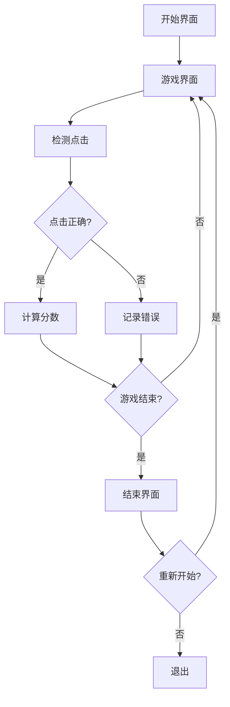

## 1. Product Overview
反应游戏是一款基于Three.js的3D视觉效果增强的反应速度测试游戏，展示前端技术能力和用户体验设计。
- 主要目的是测试用户的反应速度和准确性，同时展示Three.js的3D视觉效果和前端技术能力
- 目标用户包括潜在雇主、同行开发者、潜在客户、教育机构和个人品牌建设受众

## 2. Core Features

### 2.1 User Roles
| Role | Registration Method | Core Permissions |
|------|---------------------|------------------|
| Player | 无需注册 | 可直接进行游戏，查看分数记录 |

### 2.2 Feature Module
1. **开始界面**: 游戏标题、开始按钮、规则说明
2. **游戏界面**: 3D目标显示、计时器、分数、剩余时间/回合
3. **结束界面**: 最终得分、历史最高分、重新开始

### 2.3 Page Details
| Page Name | Module Name | Feature description |
|-----------|-------------|---------------------|
| 开始界面 | 游戏标题 | 显示游戏名称，使用Three.js创建3D标题效果 |
| 开始界面 | 开始按钮 | 点击后进入游戏界面，带有3D动画效果 |
| 开始界面 | 规则说明 | 显示游戏规则和操作方法 |
| 游戏界面 | 3D目标 | 随机生成3D目标对象，如旋转立方体、浮动球体等 |
| 游戏界面 | 计时器 | 记录反应时间和游戏总时间 |
| 游戏界面 | 分数显示 | 实时显示当前分数，基于反应速度和准确率 |
| 游戏界面 | 剩余时间/回合 | 显示游戏剩余时间或回合数 |
| 结束界面 | 最终得分 | 显示游戏结束后的最终得分 |
| 结束界面 | 历史最高分 | 显示历史最高分数记录 |
| 结束界面 | 重新开始 | 点击后重新开始游戏 |

## 3. Core Process
用户打开游戏 → 查看开始界面和规则 → 点击开始按钮 → 进入游戏界面 → 等待3D目标出现 → 点击目标 → 系统记录反应时间并计算分数 → 重复直到游戏结束 → 显示结束界面和得分 → 选择重新开始或退出

## 4. User Interface Design
### 4.1 Design Style
- 主色调: 薄荷绿 (#4ECDC4) - 游戏标题、按钮、主要UI元素
- 辅助色: 珊瑚橙 (#FF6B6B) - 目标元素、成功反馈、强调点
- 次要辅助色: 淡紫色 (#A78BFA) - 次要按钮、装饰元素
- 背景色: 浅灰白 (#F8FAFC) - 游戏背景
- 文本主色: 深石板灰 (#1E293B) - 标题、说明文字
- 文本次要色: 中灰色 (#64748B) - 辅助说明、计分板文字
- 成功色: 翠绿 (#10B981) - 成功操作反馈
- 失败色: 玫瑰红 (#EF4444) - 失败操作反馈
- 按钮风格: 3D效果，带有悬停和点击动画
- 字体: Inter (粗体 600-700 用于标题和按钮，常规 400-500 用于说明文字和计分板)
- 布局风格: 居中布局，3D元素在前景，UI元素在背景或覆盖层
- 图标风格: 简约现代，与整体设计风格一致

### 4.2 Page Design Overview
| Page Name | Module Name | UI Elements |
|-----------|-------------|-------------|
| 开始界面 | 游戏标题 | 3D文本，使用薄荷绿，带有轻微旋转动画，位于页面中央上方 |
| 开始界面 | 开始按钮 | 3D按钮，使用薄荷绿，悬停时变为珊瑚橙，点击时有按压效果 |
| 开始界面 | 规则说明 | 半透明背景的文本框，使用深石板灰文字，位于页面中央下方 |
| 游戏界面 | 3D目标 | 随机生成的3D对象，如旋转立方体、浮动球体等，使用珊瑚橙，带有发光效果 |
| 游戏界面 | 计时器 | 位于右上角，使用深石板灰文字，显示当前反应时间和游戏总时间 |
| 游戏界面 | 分数显示 | 位于左上角，使用深石板灰文字，实时更新分数 |
| 游戏界面 | 剩余时间/回合 | 位于底部中央，使用深石板灰文字，显示游戏进度 |
| 结束界面 | 最终得分 | 3D文本，使用薄荷绿，位于页面中央上方 |
| 结束界面 | 历史最高分 | 位于最终得分下方，使用中灰色文字 |
| 结束界面 | 重新开始 | 3D按钮，使用薄荷绿，悬停时变为珊瑚橙，点击时有按压效果 |

### 4.3 Responsiveness
- 设计采用响应式布局，适配不同屏幕尺寸
- 在移动设备上自动调整3D场景大小和UI元素位置
- 支持触摸事件，确保在移动设备上的良好体验
- 横屏和竖屏模式都能正常显示

### 4.4 3D Scene Guidance
- 环境: 浅灰白背景，带有轻微的渐变效果
- 灯光: 多光源设置，包括环境光和定向光，增强3D对象的立体感
- 相机: 透视相机，设置合适的视角和位置，确保3D对象清晰可见
- 构图: 3D目标对象位于屏幕中央，UI元素位于边缘，不遮挡主要游戏区域
- 交互: 点击3D对象时产生视觉反馈，如颜色变化、缩放效果和粒子爆炸
- 动画: 3D对象有轻微的旋转和浮动动画，增强视觉吸引力
- 后处理: 使用简单的后处理效果，如抗锯齿，提升画面质量
- 性能预算: 控制3D对象数量和复杂度，确保在主流设备上运行流畅（至少30fps）