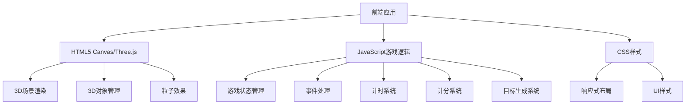

## 1. Architecture Design


## 2. Technology Description
- 前端: 原生JavaScript + Three.js + CSS3
- 3D库: Three.js (通过CDN引入)
- 字体: Inter (通过Google Fonts引入)
- 构建工具: 无（直接使用静态文件）
- 存储: localStorage (用于存储历史最高分)

## 3. Route Definitions
| Route | Purpose |
|-------|---------|
| / | 主页面，包含游戏的所有界面 |

## 4. API Definitions
无后端API，所有游戏逻辑在前端执行

## 5. Data Model
### 5.1 Data Model Definition
| 数据字段 | 类型 | 描述 |
|---------|------|------|
| score | Number | 当前游戏分数 |
| highScore | Number | 历史最高分数 |
| reactionTime | Number | 反应时间（毫秒） |
| gameTime | Number | 游戏总时间（秒） |
| round | Number | 当前回合数 |
| maxRounds | Number | 最大回合数 |
| gameState | String | 游戏状态（开始、游戏中、结束） |

### 5.2 Data Storage
使用localStorage存储历史最高分：
```javascript
// 存储最高分
localStorage.setItem('highScore', score);

// 读取最高分
const highScore = parseInt(localStorage.getItem('highScore')) || 0;
```

## 6. 核心技术实现
### 6.1 Three.js 3D场景搭建
- 场景(Scene): 创建主场景，设置背景颜色
- 相机(Camera): 使用PerspectiveCamera，设置合适的视角和位置
- 渲染器(Renderer): 使用WebGLRenderer，设置抗锯齿和大小
- 灯光(Lights): 组合使用AmbientLight和DirectionalLight，增强3D效果

### 6.2 3D目标对象
- 立方体(Cube): 随机大小和位置，带有旋转动画
- 球体(Sphere): 随机大小和位置，带有浮动动画
- 圆柱体(Cylinder): 随机大小和位置，带有旋转动画

### 6.3 粒子效果
- 成功反馈: 绿色粒子爆炸效果
- 失败反馈: 红色粒子爆炸效果

### 6.4 游戏逻辑
- 目标生成: 随机生成3D目标对象，设置随机位置和大小
- 碰撞检测: 使用Raycaster检测点击是否命中3D目标
- 计分系统: 根据反应时间计算分数，反应越快分数越高
- 计时系统: 记录反应时间和游戏总时间
- 游戏状态管理: 控制游戏的开始、进行和结束

### 6.5 响应式设计
- 监听窗口大小变化，调整渲染器和相机大小
- 在移动设备上优化触摸事件处理
- 调整UI元素位置和大小，适配不同屏幕尺寸

### 6.6 性能优化
- 使用requestAnimationFrame进行动画循环
- 合理控制3D对象数量和复杂度
- 避免不必要的计算和渲染
- 使用对象池管理粒子效果，减少内存开销